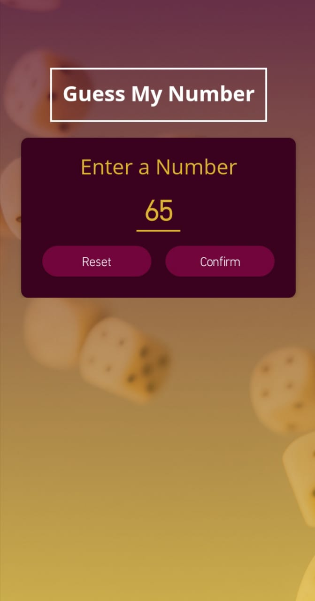
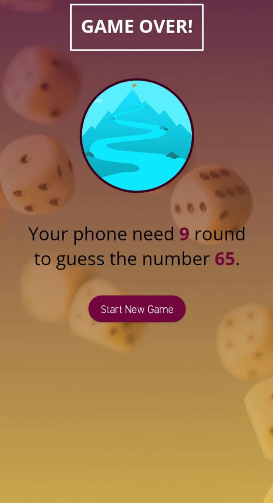
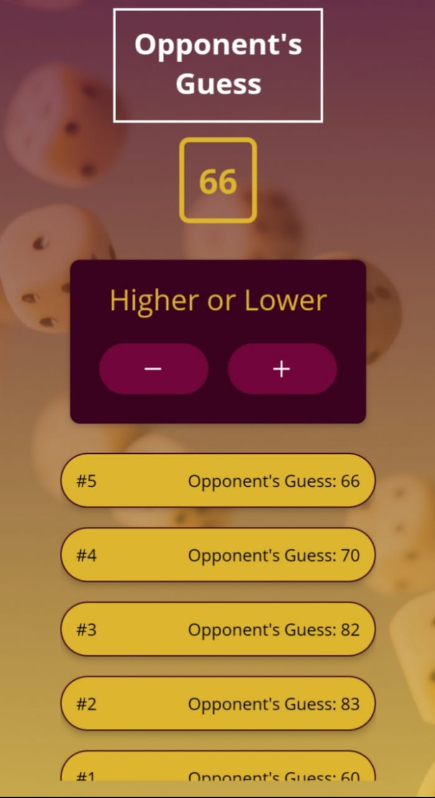
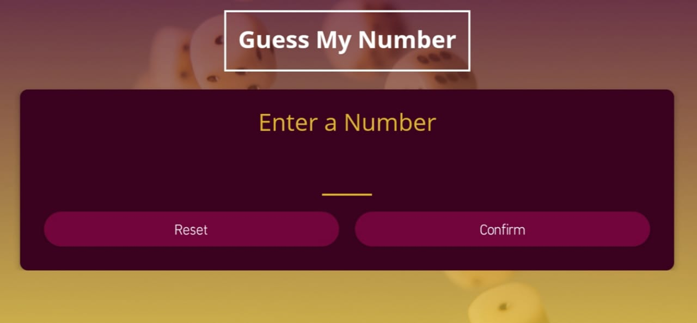
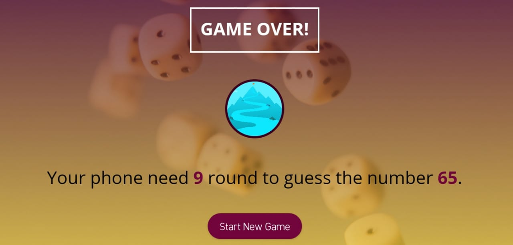

## MINI-GUESS-GAME

### Learned from : [Maximilian Schwarzmüller](https://www.udemy.com/course/react-native-the-practical-guide/)

## Images

# Landscape Mode Images

## Run Locally

- Run this command `https://github.com/aliaftabsheikh/Mini-guess-game.git`
- You are now in the dev environment and you can play around

## Tech Stack

- REACT NATIVE
- CSS3
- Javascript
- React js
- Expo CLI